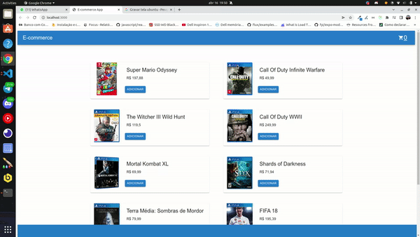

## Sobre o Projeto
Projeto de um e-commerce onde é listado uma lista de jogos e o cliente pode adicionar ao carrinho os jogos que deseja comprar, o cliente pode ver a lista de produtos que foi selecionado e confimar a compra, caso mude de ideia sobre algúm produto o cliente pode remover o produto do carrinho

Tabela de conteúdos
=================
<!--ts-->
   * [Configurando ambiente](#ambiente)
   * [Tecnologias](#tecnologias)
   * [Video](#projeto)
<!--te-->

## Como Rodar ?
De um Clone nesse repositório e de o comando npm install para baixar as dependências

### `npm start`
Roda o projeto em modo de desenvolvimento. 
Abra [http://localhost:3000](http://localhost:3000) e aproveite.

### Tecnologias
* [ReactJs](https://pt-br.reactjs.org/)
* [Redux Toolkit](https://redux-toolkit.js.org/)

* [Axios](https://axios-http.com/ptbr/docs/intro)

* [Material ui](https://mui.com/pt/)

    

